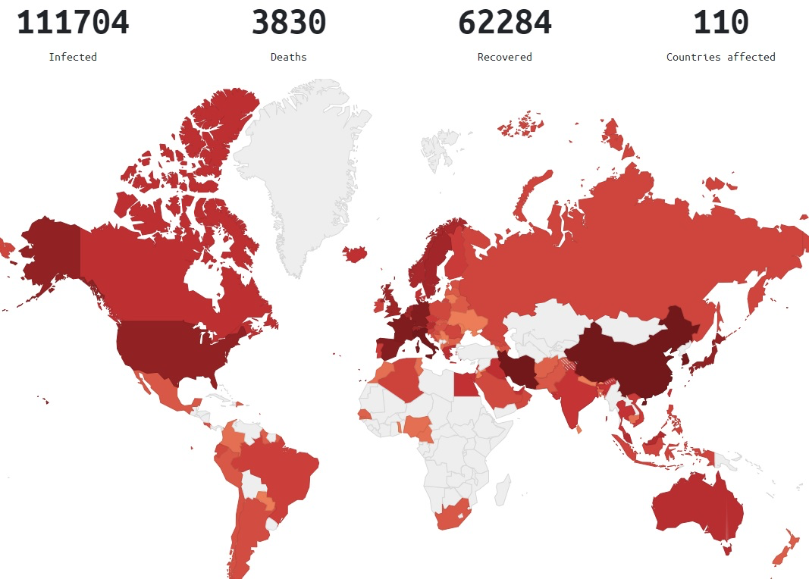

کتابچه مراقبتهای ویژه برای کووید ۱۹

[TOC]

# دربارهی این نوشتار
برای آگاهی بخشی به جامعه پزشکی فارسیزبان متن کتابچه بسیار ارزشمند مراقبتهای ویژه برای کویید ۱۹ را به فارسی ترجمه کردیم. این کتابچه توسط دو پزشک مراقبتهای ویژه آمریکایی و کانادایی به نامهای Josh Farkas و Adam Thomas تهیه شده و در حال حاضر جزو کاملترین منابع اطلاعاتی موثق برای مقابله با اپیدمی کووید۱۹ محسوب میشود. در این نوشته برای اختصار «کووید۱۹» هم برای ویروس SARS-CoV-2 و هم برای بیماری که از آن ناشی میشود به کار میرود.

# زیست‌شناسی

## مقدمه

* کووید۱۹ یک ویروس با RNA  سو مثبت یک تکه  است.
* کووید ۱۹ یکی از اعضای خانواده کورونا ویروس ها است. این ویروسها شامل
  * چهار ویروس بسیار رایج که منشا سرماخوردگی عادی هستند
  * ویروسهای سارس و مرس - که موجب اپیدمیهایی با نرخ مرگومیر بالا بودند. کووید ۱۹ بسیار به ویروس سارس شبیه است.
* این ویروس  از طریق ACE2 بر روی سلولهای آلوئولارنوع دو و اپیتلیوم روده متصل میشود (Hamming 2004)
   * این همان گیرنده ایست که  سارس به آن متصل میشود.
   * از اینرو بسیاری از درمانهای مربوط به سارس در مورد این ویروس هم باید در نظر گرفته شوند -- کووید ۱۹ شباهت زیادی به سارس دارد.
* کووید ۱۹ در حال جهش ژنتیکی است که میتواند باعث پیچیدگی بیشتر درمان شود (شکل زیر). میزان واگیر و انتقال در گذر زمان به طور غیر قابل پیشبینی تغییر خواهد کرد. شواهد جدید نشان میدهند که به طور کلی دو گونه ویروس کووید ۱۹ وجود دارند. این مساله توضیح میدهد چرا نرخ مرگومیر اولیه در ووهان چین از اخیر موارد جدید بیشتر بوده. (Tang et al. 2020; Xu et al 2020).
   * آخرین اطلاعات مربوط به تغییرات ژنتیکی گونههای جدید ویروس اینجا در دسترس هستند.

## پاتوفیزیولوژی

۱. سندرم حاد تنفسی

مسالهی اصلی در بیماری با این ویروس سندرم حاد تنفسی (ARDS) است که با آسیب منتشر آلوئولار مشخص میشود. پنوموسیتهایی با آسیب ویروسی سلولس دیده شده که نشانگر آسیب مستقیم ویروسی است. (در مقابل آسیب التهابی محض.)

۲. طوفان سایتوکاینی

شواهد جدید نشان میدهد بعضی بیماران به آلودگی با کووید19 به صورت یک طوفان سایتوکاینی قوی واکنش نشان میدهند. (با خصوصیات سپسیس باکتریال)

نشانگرهای کلینیکی میتواند افزایش CRP و فریتین را در خون نشان دهد که با شدت و مرگباری بیماری نسبت دارد.

## مراحل بیماری

* به نظر میرسد بیماری مراحل مختلفی دارد که بیماران در طول بیماری طی میکنند:
   * مرحله اول (دوره تکثیر): در طول چند روز ویروس تکثیر میشود. واکنش سیستم ایمنی ذاتی در این مرحله شروع میشود ولی موفق به کنترل گسترش ویروس نمیشود. علايم خفیفی در اثر آسیب سلولی مستقیم ویروسی و واکنش سیستم ایمنی ذاتی ظاهر میشوند.
   * مرحله دوم (دوره ایمنی تطبیقی ): در نهایت ایمنی تطبیقی نسبت به ویروس شروع میشود. در پی این مرحله تیتر ویروس کاهش پیدا میکند. از طرفی این مرحله ممکن است به افزایش التهاب سایتوکاینی و در نتیجه آسیب بافتی بیانجامد -- که منجر به وخامت وضعیت بالینی میشود.
* مراحل فوق نشان میدهد که چرا بیماران تا چندین روز علائمی بروز نمیدهند و ناگهان با ورود به مرحله دوم (دوره ایمنی تطبیقی)  دچار علايم حاد میشوند (Young et al. 3/3/2020).
* نکات فوق پیامدهای بالینی مهمی دارد:
   * از روی علائم بالینی اولیه نمیتوان شدت بیماری در مرحله دوم را پیشبینی کرد. روشهای پیچیدهای برای طبقهبندی بیماران از نظر ریسک و دیسپوزیشن نیاز است.
   * احتمالا درمانهای ضد ویروس باید بسیار زود (در مرحلهی تکثیر ویروس) آغاز شود تا اثر بخش باند.
   * احتمالا درمان سرکوب سیستم ایمنی (مثلا استروید دوز پایین) باید در دوره دوم ( ایمنی تطبیقی) با هدف کند کردن پاسخ ایمونوپاتولوژیک در بیماران بسیار بدحال انجام شوند. این پیشنهاد هنوز مبتنی بر حدس و گمان است.

# کنترل عفونت

# انتقال

## انتقال از طریق قطرات درشت

* انتقال کووید ۱۹ از طریق ترشحات درشت دهان و بینی ( از فاصله تقریبی ۲متری بیمار) امکان پذیر است.  (Carlos del Rio 2/28)
* این گونهی انتقال روشی معمول برای انتقال ویروس های تنفسی مانند آنفولانزا است.
* این نوع انتقال از طریق ترشحات با ماسک های استاندارد جراحی قابل پیشگیری است.

## انتقال از طریق هوا airborne transmission

* انتقال کووید ۱۹ از طریق ذرات معلقی که از توسط بیمار در هوا منتشر شده موضوعی بحث برانگیز است. در صورتی که روش انتقال هوایی ویروس صحت داشته باشد به جای استفاده از ماسک استاندارد جراحی احتیاج به استفاده از ماسک  N95 یا FPP2 میباشد. ادامه این بحث را اینجا میتوانید دنبال کنید Shiu et al 2019.
* تمهیدات پیشگیرانه سختگیرانهای برای جلوگیری  انتقال هوایی ویروس MERS و SARS بر مبنای احتیاط اتخاذ شده بوده است. این در حالی است که این تمهیدات بر پایه شواهد علمی واضح بر اساس انتقال از طریق ترشحات معلق در هوا نبوده است. با این حال همین ملاحظات پیشگیرانه برای جلوگیری از انتقال هوایی کووید۱۹ دنبال می شود.
* دستورالعمل ها برای جلوگیری از انتقال ویروس متفاوت است:
   * دستورالعمل های کانادا  Canadian Guidelines و سازمان بهداشت جهانی World Health Organization guidelines تنها استفاده از تمهیدات پیشگیرانه برای جلوگیری از انتشار قطرکی ویروس را در زمان مراقبت های روتین بیمار پیشنهاد میدهند. اگر چه هر دو این دستور العمل ها استفاده از تمهیدات پیشگیرانه  برای جلوگیری از انتشار هوایی ویروس در زمان روند های تشخیصی و درمانی مانند intubation, noninvasive ventilation, CPR, bag-mask ventilation, and bronchoscopy را لازم میدانند.
   * مرکز کنترل و پیشگیری بیماری های ایالات متحده آمریکا (CDC) استفاده از تمهیدات پیشگیرانه برای جلوگیری از انتقال ویروس  به شکل هوایی را در تمام موارد نگهداری و مدیریت بیمار الزامی می داند.
* استفاده از تمهیدات  لازم برای جلوگیری از انتقال ویروس به شکل هوایی باعث کمبود سریع ماسک های N95 میشود و این روند باعث میشود کادر درمانی در هنگام انجام روند های تشخیصی و درمانی مانند intubation, noninvasive ventilation, CPR, bag-mask ventilation, and bronchoscopy

در معرض خطر قرار بگیرند.
* در شرایط همه گیری جهانی (pandemic) بیماری توصیه های کانادا و سازمان بهداشت جهانی  به خصوص برای کشورها با منابع محدود معقول تر به نظرمیرسد. گرچه در مورد کنترل عفونت ها باید حتما به راهنمایی ها و توصیه های بیمارستان ها و مراکز درمانی محلی رجوع کرد.

## انتقال تماسی (انتقال از اشیا به صورت) (“fomite-to-face”)

* نوع انتقال بیماری تماسی به مقدار زیادی نادیده گرفته میشود. در حالیکه توجه به این مورد بسیار اهمیت دارد. موارد زیر راه های انتقال تماسی را مورد بررسی قرار می دهد:
   * کسی که کووید۱۹ دارد، سرفه میکند و قطرات ویروسی خود را پراکنده میکند. ترشحات بر روی سطوح می نشینند و لایه ای از ویروس بر روی سطوح شکل میگیرد. این ویروس ممکن است در دیگر مایعات و ترشحات بدن بیمار چون خلط، بزاق ،ترشحات بینی ،مدفوع ،ادرار و خون وجود داشته باشدشود. در نتیجه راه های گوناگونی برای پخش کردن ویروس توسط فرد آلوده وجود دارد.
   * ویروس بر روی اشیا در محیط مقاومت خوبی دارد. ویروس کرونای انسانی بر روی سطوح تا یک هفته میتواند زنده بماند (Kampf et al 2020). دقیقا مشخص نیست که ویروس کرونا تا چه مدت در محیط زنده می ماند اما ممکن است کووید ۱۹ به مدت طولانی تری در محیط زنده بماند چون بعضی از گونههای حیوانی ویروس کرونا تا هفته ها در محیط زنده می مانند!
   *  اگر شخص دیگری  به سطوح آلوده ساعت ها یا روزهای بعد دست بزند ویروس به دست او منتقل میشود.
   * اگر فرد با دست آلوده به غشای مخاطی نظیر دهان، بینی، و یا چشم خود دست بزند عفونت ممکن است به فرد منتقل شود.
* هر نوع تلاشی بر جلوگیری از گسترش ویروس باید توجه ویژه ای به انتقال نوع تماسی داشته باشد. چرخه انتقال ویروس به روش بالا به راه های گوناگونی قابل جلوگیری است:  
   * تمیزکردن مرتب سطوح با اتانول ۷۰٪ و محلول ۰.۵٪ سدیم هایپوکلورایت  sodium hypochlorite یا به عبارتی وایتکس یا آب ژاول. برای جزئیات بیشتر به دستورالعمل های مرکز کنترل و پیشگیری بیماری های ایالات متحده آمریکا CDC guidelines و این مقاله  Kampf et al 2020 مراجعه شود.
   * رعایت بهداشت دست برای جلوگیری از انتقال بسیار مهم است. استفاده از اتانول برای ضدعفونی دست در صورتی که دست به وضوح کثیف نباشد ارجحیت دارد (Kampf 2017).
   * دست نزدن به صورت بسیار مهم است. اما چون ما به طور ناخودآگاه مرتب به صورتمان دست میزنیم تقریبا جلوگیری از این کار غیر ممکن است. در نتیجه پوشیدن ماسک جراحی برای عدم تماس دست با صورت  دهان و دماغ  مفید است.
* هرگونه وسایل پزشکی ممکن است به ویروس آلوده شوند و ویروس به پرسنل درمان منتقل شود. یک تحقیق اخیر نشان میدهد که کووید۱۹ به شکل گستردهای همه اتاق یک بیمار مبتلا را آلوده کرده بوده است اما خوشبختانه به نظر می آید که آلودگی ویروسی محل مراقبت از بیماران با sodium dichloroisocyanurate قابل تمیز کردن است (Ong et al 2020).

## چه زمانی انتقال بیماری ممکن است؟

1. انتقال بیماری بدون داشتن علامت امکان پذیر است (Carlos del Rio 2/28).

2. بعضی بیمارانی که  از کویید۱۹ بهبود کلینیکی یافته اند همچنان می توانند ویروس را در محیط پراکنده کنند.
   * یک تحقیق اخیر نشان می دهد که بعد از دوران نقاهت PCR فارنژیال pharyngeal PCR  بیماران ممکن است تا هفته ها مثبت باشد (Lan 2/27). گرچه اهمیت و تاثیر گذاری کلینیکی این نتایج PCR نامشخص است. بیماران بهبود یافته ممکن است با احتمال کمتری بتوانند ویروس را منتشر و افراد دیگری را بیمار کنند.
   *  دستورالعمل های مرکز کنترل و پیشگیری بیماری های ایالات متحده آمریکا در مورد مدت زمان ایزوله کردن بیماران مبتلا به کووید۱۹ مبهم است. در چنین شرایطی بهترین توصیه این است که هر دو تست RT-PCR (یکی از nasopharynx و یکی از pharynx)  با فاصله ۲۴ ساعت  از هم گرفته گرفته شود تا اطمینان حاصل شود که بیمار بهبود یافته خطری برای جامعه ندارد.

## نرخ بازتولید پایه R0

* نرخ بازتولید پایه (R0) متوسط تعداد افرادی است که توسط یک شخص مبتلا آلوده میشوند
   * اگه این نرخ از ۱ کمتر باشد، اپیدمی از بین میرود
   * اگر این نرخ ۱ باشد، اپیدمی به صورت یکنواخت ادامه پیدا میکند
   * اگه این عدد از ۱ بیشتر باشد، اپیدمی به صورت نمایی گسترش پیدا میکند
* تخمین فعلی برای نرخ بازتولید کووید۱۹ بین ۲.۵ و ۲.۹ است (Peng PWH et al, 2/28). این عدد کمی از آنفولانزای فصلی بالاتر است.
* نرخ بازتولید هم تابع ویروس است و هم رفتار انسانی. کارهایی چون افزایش فواصل اجتماعی یا بهداشت بهتر شخصی R0 را کاهش میدهند
   * کنترل انتقال کووید۱۹ در چین نشان میدهد میدهد که R0 عددی قابل تغییر است که با دخالتهای بهداشت عمومی میتواند کاهش پیدا کند
   * نرخ بازتولید بر روی کشتی تفریحی Diamond Princess عدد ۱۵ بود که نشان میدهد فشردگی انسانی و بهداشت ناکافی R0 را افزایش میدهند.

# تجهیزات حفاظت شخصی

## تجهیزات

* لوازم لازم برای جلوگیری از تماس ( گان و دستکش ضد آب)
* استفاده از ماسک که در قسمت انتقال بحث شد.
   * ماسک N95 یا PARP یا powered, air-purifying respiratory.
   *  بر طبق  دستورالعمل های مرکز کنترل و پیشگیری بیماری های ایالات متحده آمریکا و سازمان بهداشت جهانی ماسک جراحی برای بیمارانی که  روند های تشخیصی و درمانی مانند intubation, noninvasive ventilation, CPR, bag-mask ventilation, and bronchoscopy را انجام نمی دهند لازم است.
* عینک یا محافظ چشم
* نکته: استفاده صحیح از لوازم حفاظتی اهمیت ویژه دارد.

## استفاده و بیرون آوردن تجهیزات حفاظت شخصی ( پوشیدن و در آوردن)

* دانستن اینکه چگونه تجهیزات حفاظت شخصی پوشیده و درآورده شوند بسیار مهم است. به خصوص اگر انتقال تماسی احتمال زیادی داشته باشد.
* درآوردن  تجهیزات آلوده حفاظت شخصی بسیار مهم و سخت است.
* پوشیدن و درآوردن تجهیزات حفاظت شخصی باید قبل تماس با بیمار تمرین شود.
* ویدیو پایین استفاده از تجهیزات حفاظت شخصی را توضیح میدهد (می توانید ۵ دقیقه اول ویدیو را رد کنید).

[NETEC: Personal Protective Equipment for COVID-19](https://youtu.be/bG6zISnenPg)

## نکات مهم درباره  تجهیزات حفاظت شخصی

*  باید توجه خاصی به محل تقاطع گان و دستکش ها شود. گان باید در داخل دستکش باشد یعنی به عبارتی دستکش روی گان قرار بگیرد که هیچ فاصله ای بین گان و دستکش نباشد. استفاده از دستکش های بلند که شباهت به دستکش های استریل جراحی دارند این کار را آسانتر میکند. استفاده از دستکش های بلند در آوردن گان و دستکش را به صورت یکدفعه و با هم راحت تر میکند.
* وقتی تجهیزات حفاظت شخصی را میخواهید درآورید اول همیشه دستکش ها را با ضد عفونی کننده های الکلی تمیز نمایید.
* بعد از در آوردن تجهیزات حفاظت شخصی دست ها و مچ خود را با ضد عفونی کننده های الکلی تمیز نمایید.

# جستجوی بیماران و ناقلان

## نکات کلیدی

* سفر به مناطقی که تحت تاثیر بیماری قرار گرفتند.
   * در مناطقی که انتقال بیماری به شکل محلی است سرعت انتقال بسیار سریع است.
   * دوران نهفتگی یا کمون بیماری تا ۱۴ روز است در نتیجه  افراد سفر کرده به مناطق پر خطر در این بازه زمانی ممکن است ناقل باشند.
* تماس  و نزدیک بودن کمتر از ۱۸۲ سانتی متر به فرد مبتلا به کووید ۱۹ باعث انتقال بیماری میشود.
* در حالیکه ابتلا بیماری به شکل محلی در حال افزایش است احتیاج به تست های گسترده تر  بر اساس ارزیابی های کلینیکی می باشد:
   * بررسی بیماران  به روش هایی آزمایشگاهی و تصویربرداری که مطمئن شویم از نظر کلینیکی بیمار هستند.
   * توجه به حضور یا عدم حضور تشخیص های دیگر. برای مثال اگر تست بیماری برای آنفولانزا مثبت باشد احتمال خیلی کمی وجود دارد که بیمار به طور همزمان به آنفولانزا و کرونا مبتلا باشد.

## نوع برخورد با ایزوله کردن و تست کردن

* در زیر استراتژی های لازم برای ایزوله فرد مبتلا یا مشکوک به ابتلا بررسی میشود اگرچه ممکن است تا الان این   استراتژی های کمی از رده خارج باشد به دلایل زیر:
   * مرکز کنترل و پیشگیری بیماری های ایالات متحده آمریکا (CDC) ریسک سفر به مناطق آلوده را به روز رسانی کرده است. سفر به کشورهای کره جنوبی ایران ایتالیا و ژاپن و حتی بعضی مناطق دیگر در اروپا ریسک بالایی دارد.
   * در مناطقی که انتقال به شکل محلی است انجام تست برای تشخیص بیماری در افرادی که به طور واضح در تماس با محیط یا فرد آلوده نبودند لازم است.
* این ها فقط راهنمایی های کلی است و افراد باید به پروتکل های محل کار خود توجه کنند. ارتباط تنگاتنگ با متخصصان بیماری های عفونی و موسسات بهداشت ذیربط در این رابطه بسیار مهم است.
   * توجه داشته باشید که بعضی بیماران علایم گوارشی نشان میدهند. متاسفانه بسیاری از بیماران تشخیص داده و ایزوله نمیشوند.

# تشخیص نشانه ها و علایم

## نشانهها و علائم

* کووید۱۹ باعث علائم بیماری عمومی، سیستم تنفسی فوقانی، سیستم تنفسی تحتانی، و به ندرت علائم سیستم گوارشی میشود. بیشتر بیماران نشانههای عمومی و سیستم تنفسی تحتانی را گزارش میکنند.
* تب
   * پراکندگی تب در بیماران بر اساس گزارشهای مختلف متغیر (بین ۴۳ تا ۹۸ درصد بر اساس جدول فوق). دلیل این مساله ممکن است به جزئیات روش به کار رفته در تحقیقات مختلف، درجات مختلف بیماری بین افراد مورد تحقیق و یا حتی گونههای مختلف ویروس مود در نقاط مختلف باشد.
   * نبود تب دلیل بر نداشتن کووید۱۹ نیست.
* تظاهرات گوارشی: تا ۱۰ درصد بیماران در مراحل اولیه دچار علائم سیستم گوارشی (اسهال و تهوع) میشوند که معمولا از تب و تنگینفس زودتر ظاهر میشوند (Wang et al. 2/7/20).
* کاهش نامحسوس سطح اکسیژن (Silent hypoxemia): بعضی بیماران (به خصوص افراد مسن) دچار کاهش سطح اکسیژن و مشکلات تنفسی بدون عوارض تنگینفس میشوند (Xie et al. 2020).
* معاینات پزشکی معمولا مشخصکننده نیستند. ۲٪ بیماران میتوانند فارنژیت (التهاب گلو) یا تورم لوزه داشته باشند (Guan et al 2/28).

## مراحل بیماری

* دوره کمون بیماری معمولا ۴ روز است (رنچ ۲۵٪ تا ۷۵٪ توزیع آماری ۲ تا ۷ روز است) و حداکثر میتواند ۱۴ روز باشد (Carlos del Rio 2/28).
* مراحل تیپیکال حاد بر اساس تحقیقات متعدد (Arnold Forest)
   * تنگی نفس (Dyspnea) تقریبا ۶ روز پس از انتقال
   * پذیرش بیمار تقریبا پس از ۸ روز پس از انتقال
   * نیاز به اینتیوبیت شدن یا انتقال به ICU تقریبا ۱۰ روز پس از شروع بیماری (این زمانبندی میتوانند متغیر باشد)

# آزمایشات و تستها

## آزمایشات خونی

* WBC معمولا نرمال است
* لنفوپنی در ۸۰٪ بیماران دیده میشود (Guan et al 2/28, Yang et al 2/21).
* ترومبوسیتوپنی خفیف رایج است (پلاکت ها به ندرت از ۱۰۰ هزار کمتر میشوند). سطح پایینتر شمار پلاکت نشان از پیشآگهی ضعیف بیماری است.

## تستهای انعقاد خون
* معمولا بلافاصله پس از پذیرش بیمار تست انعقاد خون انجام میشود هر چند مشاهده سطح بالای D-dimer رایج است (جدول بالا)
* انعقاد بین عروقی در طول زمان افزایش پیدا میکند که با پیشاگاهی بیماری ارتباط دارد (شکل پایین) (Tang et al. 2020).

## نشانههای التهابی

### پروکلسیتونین
   * کووید۱۹ ظاهرا باعث افزایش پروکلسیتونین نمیشود. به عنوان مثال بزرگترین تحقیقات نشان داد که سطح پروکلسیتونین در ۹۵٪ بیماران زیر ۰.۵ بود (Guan et al 2/28).
   * سطح بالای پروکلسیتونین میتواند نشاندهنده بیماریهای دیگری (مانند پنومونی باکتریایی) باشد. برای بیماران کووید۱۹ سطح بالای پروکلسیتونین نشاندهنده ابتلا همزمان به آلودگی باکتریایی است.

### پروتئین C-reactive یا CRP
   * کووید۱۹ سطح CRP را افزایش میدهد. به نظر میرسد این نشانه با پیشرفت بیماری افزایش پیدا میکند. در بیماران با مشکلات تنفسی شدید و سطح نرمال CRP اتیلوژیهای غیر از از کووید (مانند مشکلات قلبی) را در نظر بگیرید.
   * سطح گزارششده CRP برای بیمارانی که نیاز به اکسیژن ندارند ۱۱ میلیگرم بر لیتر با IQR بین ۱ و ۲۰). این عدد برای بیماران هایپوکسمیک به طور متوسط ۶۶ میلیگرم بر لیتر و IQR بین ۴۸ تا ۹۸ میباشد.(Young et al. 3/3)
   * سطح CRP با ریسک مرگومیر مرتبط است. میانه برای بیمارانی که زنده ماندند ۴۰ میلیگرم بر لیتر و برای بیماران اکسپایر شده ۱۲۵ بود.

## مقایسه روشهای مختلف تشخیص

* PCR برای آنفولانزا و سایر بیماریهای تنفسی میتواند مفید باشد. تشخیص بیماریهای دیگر دلیل بر نداشتن کووید۱۹ نیست.
* تستهای متداول موجود در بسیاری از بیمارستانها برای covonavirus
   * این تستها برای کووید ۱۹ کار نمیکنند
   * این تستها برای چهار نوع دیگر ویروسهای کرونا که منجر به سرماخوردگی معمول میشوند هستند
   * جالب است بدانید اگر تست بیمار با تستهای متداول مثبت شد، احتمال داشتن کووید ۱۹ کمتر است.
* تست کاشت خون به صورت رایج باید انجام شود

# تستهای مختص کووید ۱۹

## نمونهگیری

* از Nasopharyngeal swab استفاده کنید
* چنانچه بیمار اینتوبیت شده از  tracheal aspirate استفاده کنید
* چنانچه بیمار اینتوبیت شده میتوانید از لاواژ Bronchoalveolar یا  induced sputum استفاده کنید. هرچند این نوع نمونهگیری ریسک زیادی برای انتقال دارند.
   * به یاد داشته باشید اینکه این گونه تستها موثر هستند ثابت نشده است.

## محدودیتها

* کارایی این تست مشخص نیست. تا زمانی که روش قطعی برای تشخیص کووید۱۹ پیدا نشوند اندازه گیری دقت تست ممکن نیست.
* ویژگی تست (specificity) بالا است (آلودگی نمونهها میتواند منجر به خطای مثبت شود)
* حساسیت (Sensitivity) تست خوب نیست
   * در مقایسه با شواهد بالینی و سیتیاسکن حساسیت تست ۷۰٪ گزارش شده هرچند امکان دارد بعضی بیمارن دارای نشانههای بالینی مبتلا به ویروسهای دیگری به جز کووید۱۹ بودهاند.
   * یک تست منفی نباید دلیل بر نداشتن کووید۱۹ تلقی شود
   * چنانچه تست بیماری منفی بود اما نشانههای بالینی موجد بود بیمار را قرنطینه کنید و نمونهگیری را تکرار کنید.

ویژگی تست بالاست اما آلودگی نمونهها میتواند باعث نرخ بالای false positive شود.

## دقت تست چندان خوب نیست

* دقت این تست قابل مقایسه با سیتی اسکن است
* در میان گروهی از بیماران که مشکوک به کووید۱۹ بودند و در ابتدا تست PCR آنها منفی بود، تکرار تست در ۱۵ مورد از ۶۴ نفر مثبت بود. این به معنی دقت حدود ۸۰٪ این تست است. تبدیل شدن نتیجه تست از منفی به مثبت چندین روز به طول انجامید. این در حالی است که سیتیاسکن قالبا بروز بیماری را خیلی زودتر نشان میدهد (Ai et al.)
* نتیجهگیری:
   * دقت تست PCR در حدود ۷۵٪ است
   * منفی بودن یک تست PCR دلیل بر سالم بودن شخص نیست (به خصوص اگر نمونه نسوفریجیال باشد یا در ابتدای بروز بیماری گرفته شده باشد)
   * چنانچه نتیجه RT-PCR منفی است اما احتمال میدهید بیمار مبتلا به کووید۱۹ همچنان فرایند قرنطینه را دنبال کنید.

# عکسبرداری CXR & CT Scan

## توصیفات کلی یافتههای عکس رادیولوژی و سیتی اسکن  

* مشخصترین یافته موجود در عکسها نقاط شفاف پراکنده است که که عموما  پایین یا اطراف قفسه سینه دیده میشوند (Shi et al 2/24). تعداد قطعات درگیر شش با افزایش شدت بیماری افزایش پیدا میکند. با گذر زمان، نقاط پراکنده شفاف متصل شده به توده چگال تبدیل میشوند.
* ضایعات در عکس رادیولوژی به راحتی قابل مشاهده نیستند.
* مواردی که معمولا دیده نمیشوند و میتوانند نشانه بیماریهای دیگر یا همزمان باشند
   * نشد پرده جنب (Pleural) معمولا تنها در ۵٪ موارد دیده شده
   * کووید۱۹ به نظر نمیرسد باعث توده، حفره یا تغییر اندازه قدد لمفاوی نمیشود

## دقت و تاخیر زمانی در تصاویر رادیولوژی و سیتی اسکن

* محدودیت دادهها
   * دادههای مطالعات مختلف متناقض هستند. این احتمالا به دلیل شدت و حدت متفاوت بیماری است.
* حساسیت و دقت سیتی اسکن
   * گوان و همکاران در ۸۶٪ بیماران دارای عوارض که به بیمارستان مراجعه کردند ابنرمالیتی در تصاویر سیتی مشاهده کردند. مشبها فنگ و همکاران در ۵۰ نفر از ۵۱ مورد این مشاهدات را گزارش کردند.
   * در بیماران با عوارض عمومی که عوارض تنفسی ندارند حساسیت سیتی اسکن کمتر است (تقریبا ۵۰٪) (Kanne 2/27).
* ابنرمالیتی سیتی اسکن میتواند قبل از بروز علائم مشهود باشد؟
   * شی و همکاران بر روی ۱۵ خدمه درمانی که در معرض کووید۱۹ قرار داشتند، قبل از بروز علائم سیتی اسکن انجام دادند
   * در ۱۴ مورد از ۱۵ نفر ماتی زمینه عکس سیتی اسکن مشاهده شد. در ۹ مورد اطراف ششها درگیر شده بودند (بعضی در طرفین بو بعضی در یک طرف)
* عکس قفسه سینه
   * در مورد دقت عکس قفسه سینه اطلاعات کمتری جمعآوری شده
   * میتوان تصور کرد دقت عکس اشعه ایکس از سیتی اسکن کمتر است
   * در یک مطالعه، عکس قفسه سینه بر روی بیماران مراجعه کننده به یک بیمارستان دقت یافتهها ۵۹٪ بود.

# سونوگرافی ریهها

## Technique

## Findings

## Performance

* در حال حاضر اطلاعاتی در زمینه استفاده از سونوگرافی (ultrasonography) ششها برای کووید۱۹ در دسترس نیست. با این وجود، الگوهای شیشهای جانبی در سیتی اسکن خود را به صورت خطوط  B-lines در سونوگرافی نشانمیدهند. این مسئله میتواند به حدسیات زیر بیانجامد
   * رایجترین شکل قابل مشاهده در در سونوگرافی ریه خطوط B-line خواهد بود.
   * حساسیت مشاهدات سونو به موازات پیشرفت شدت بیماری افزایش پیدا میکند
   * برخی بیماران ممکن است حتی پیش از علائم بیماری ابرنمالیتی در سونوگرافی نشان دهند
   * برخی بیماران احتمالا پنومونی خفیف و زودهنگام بروز میدهند که با عکس رادیولوژی قابل تشخیص نیست اما با سونوگرافی قابل تشخیص است.
   * برای افزایش دقت، سونوگرافی کامل ریه باید انجام شود. سونوگرافی ساده از تنها دو نقطه به راحتی میتوانند موارد مشکوک را پنهان نگاه دارد.

# General approach to imaging

# All imaging modalities are nonspecific

# possible approach to imaging in COVID 19

# برونکوسکوپی

* ریسک های برونکوسکوپی:
   * احتمال بدتر شدن شرایط بالینی
   * ریسک بسیار بالای انتقال بیماری
   * نیاز با منابع و امکانات زیاد -- امکاناتی که در زمان اوج اپیدمی به شدت محدود خواهند بود.
* فواید
   * فواید انجام برونکوسکوپی برای درمان کووید۱۹ چندان مشخص نیست
* نتیجهگیری
   * چنانچه به دلایل دیگری نیاز به انجام برونکوسکوپی هست میتوانید برای کووید۱۹ هم در نظر بگیرید
   * برای تشخیص کووید۱۹ نباید از برونکوسکوپی استفاده کرد.

# درمان

# اصول اولیه: پشتیبانی و مراقبت از بیماران با پنمونی ویروسی

## اصل کلی: جلوگیری از استثنا فرض کردن کووید ۱۹

* ما درمان نمونیای شدید ویروسی و ARDS را میدانیم و این کار را سالهاست که انجام میدهیم.
* هنوز هیچ شواهد علمی قانع کننده ای وجود ندارد که نشان دهد اصول درمانی کووید ۱۹ تفاوت زیادی با نمونیا های ویروسی دیگر مثل آنفولانزا داشته باشد.
* استزاتژی ضروری درمان برای کووید ۱۹ مراقبت پشتیبانی است که باید به همان شکل که برای هر بیمار با نمونیای شدید ویروسی انجام می شود انجام پذیرد. برای مثال روند درمان باید به همان شکل  که برای آنفولانزا انجام می شود انجام شود البته به جز oseltamivir.
* در زیر اصلاحات تطبیقی مطرح شده که بیشتر مرتبط با مراقبت از بیماران کووید ۱۹ است. آگرچه  اصول کل درمان برای همه نمونیا های ویروسی یکی است.

# درمانهای ضد ویروسی

## درمانهای ضد ویروسی بالقوه

* هیچ  درمان ضد ویروس اثبات شده ای برای کوید ۱۹  که در انسان کار کند هنوز وجود ندارد. تعدادی آزمون علمی کنترل شده تصادفی در حال اجراست به این امید که اطلاعات بیشتری به ما بدهد. اگر مقدور بود بیماران میتوانند در این آزمایشات شرکت کنند.
*   اطلاعات فراهم شدهی زیر راه های درمانی محبوبی هستند که که توسط بعضی پزشکان استفاده میشود.
   * در این فصل  لزوما توصیه نمیشود که از یک یا چندین درمان پیشنهادی که اینجا نام برده می شود استفاده کرد. این اطلاعات صرفا برای فراهم کردن زمینه ای است که به ما کمک کند درمان ها را بهتر بشناسیم.
   * در حال حاضر به خاطر در دسترس بودن تمرکز بر درمان بوسیله lopinavir/ritonavir و chloroquine است.
   * پزشکان تشویق میشوند که شواهد موجود را بررسی کنند و در نهایت خود درباره دارو مورد نیاز بیمار تصمیم بگیرند.
   * اگر شما هم اطلاعاتی درباره شواهد کارکرد داروهای ضد ویروسی دارید لطفا در وب پیج کووید ۱۹ با ما به اشتراک بگذارید.

## درمان های تک دارویی در مقابل چند دارویی

* نکته ای که هنوز اطلاعات دقیقی از آن در دست نیست این است که نمیدانیم آیا درمان تک دارویی برای کووید۱۹ لازم است یا درمان از ترکیب چندین داروی ضد ویروسی.
* همانند درمان HIV ممکن است ۲ یا ۳ داروی ضد ویروس همزمان لازم به استفاده باشد. گرچه ترکیب داروها ممکن است احتمال مسمومیت را بالا ببرد به خصوص cardiotoxicity.

## نشانه ها برای درمان ضد ویروسی: چه کسی و چه وقت؟

* چه وقت؟
   * داده های گذشته به دست آماده در مورد SARS حاکی از آن است که درمان زودتر(در ۱-۲ روز اول که بیمار پذیرش شد) ممکن است تاثیرگذارتر است از جلوگیری از دادن دارو تا وقتی است که ارگان ها شروع به از کار افتادن میکنند (Chan 2003). این داده ها با داده ها درباره آنفولانزا مطابقت دارد که پیشنهاد درمان زود هنگام در بازه زمانی محدودی میکند.
* چه کسی؟
   * بسیاری بیماران بدون درمان بهبود می یابند و در نتیجه نیاز به داروهای ضد ویروس نیست.
   * گرچه جلوگیری از درمان تا زمانی که بیمار بد حال شود ممکن است باعث شود بازه زمانی که بیماری با درمان به سمت بهبود پیش میرود از دست برود.
   *  فاکتورهای پیش بینی نتایج بد می تواند?????? به ما کمک کند و نشان دهد که چه بیماری بد حال می شود و در نتیجه چه کسی از داروهای ضد ویروسی منفعت میبرد. ( به قسمت پیش بینی بیماری prognosis در پایین مراجعه شود.

# رمدیسیویر Remdesivir  

* بر اساس تحقیقات آزمایشگاهی برروی MERS و داده های بررسی شده بر روی حیوانات Remdesivir ممکن است بهترین ضد ویروس در این مورد باشد( Sheahan 2020).  
* متاسفانه Remdesivir دارویی تجاری و قابل دسترس نمی باشد.این دارو قبل از دریافت مجوز سازمان غذا و دارو آمریکا (FDA ) بر روی یک بیمار کووید ۱۹ که شرایط بحرانی داشته است در آمریکا استفاده شده است(Holshue 2020).
* این دارو (Remdesivir) به شکل آزمایشی one trial با پشتیبانی NIAID در ایالات متحده آمریکا در حال استفاده می باشد. ثبت نام در این آزمایش می تواند برای درمان های ویروسی نوید بخش باشد.

# کالترا lopinavir/ritonavir

## توضیحات کلی:

* این داروها ترکیباتی از داروهای ضد ویروسی هستند که برای HIV استفاده می شوند ( این مهم شامل داروهای پیشگیرانه در صورت تماس فرد با سوزن آلوده به ویروس هم می باشد).
* در مقایسه با Remdesivir دارو ها ی lopinavir/ritonavir مزیتی که دارند قابل دسترس بودن و دانسته های ما درباره مسمومیت های مرتبط با آن ها است (عوارض و تداخل دارویی شناخته شده است اما قابل اغماض می باشد).
* داروهای lopinavir/ritonavir به نظر میاید که به طور همزمان با ribavirin کار می کند. داده های انسانی بر روی SARS و MERS حکایت از ترکیب این سه دارو دارد. ممکن است ترکیبی از این سه دارو برای تاثیر بهتر بر روند بهبود لازم باشند (احتمال کار نکردن این داروها به شکل تکی وجود دارد). یک تحقیق کوچک بر روی lopinavir/ritonavir نشان داد که درمان سه گانه با lopinavir/ritonavir/ribavirin ممکن است لازم باشد (Young 3/3/20).

## مکانیزم و عملکرد

* داروهای lopinavir و ritonavir مهارکننده های پروتئینی و پپتیدی هستند که تکثیر ویروسی را متوقف میکنند.
* داروی lopinavir به نظر می آید که روی ویروس کار میکند و تاثیر میگذارد. Ritonavir مهارکننده CYP3A است که متابولیسم lopinavir را کم میکند در نتیجه حد lopinavir را بالا می برد.

## داده های آزمایشگاهی

*  آزمایشات بر روی داروی lopinavir در مورد SARS نشان داده که در صورت غلظت ۴ ug/ml به عنوان ضد ویروس عمل میکند. گرچه وقتی با ribavirin ترکیب می شود به نظر می آید lopinavir تاثیر گذار تر است (با تمرکز مهارکنندگی ۱ ug/m).  

(Chu et al. 2004)
*  اوج و حضیض سرم متمرکز lopinavir   و ۵.۵ و۱۰ ug/ml است (Chu et al. 2004).     

## داده های جانوری

* داروهای lopinavir و ritonavir  بر روی MERS-CoV در مدل های حیوانی دسته میمون ها تاثیر گذار بودند(Chan 2015).

## داده های انسانی    

* مطالعه Chu et al. 2004 مقایسه ای open-labee (بیماران و درمانگران هر دو درباره نوع ومراحل درمان آگاهی دارند): بر روی سارس:  
   * چهل و یک  بیمار با مصرف  lopinavir/ritonavir و ribavirin مورد مطالعه قرار گرفتند این گروه با ۱۱۱ بیمار دیگری که در یک مطالعه مقایسه ای شرکت کرده بودند و تنها با ribavirin تحت معالجه بودند مقایسه شدند. گرچه باید توجه داشت که بیمارانی که  lopinavir/ritonavir مصرف می کردند  lactate dehydrogenase یا LDH پایین تری از ابتدای شروع تحقیق داشتند در نتیجه شدت بیماری در آن ها کمتر بود.
   * نتایج کلینیکی نامطلوب چون مرگ و ARDS در افرادی که در مطالعه شرکت کرده بودند کمتر بود (۲.۴٪ در مقابل ۲۹٪). این نتیجه های متفاوت با توجه به وجود تفاوت های اولیه در LDH  در مدل های چند متغییره قابل مشاهده بود.
   * استفاده از lopinavir/ritonavir با کم شدن  چشم گیر بار ویروسی ارتباط معنا داری داشته است ( به نمودار بالا توجه شود).
   * همه بیماران به طور همزمان ribavirin دریافت کردند. دوز دریافتی ۴ گرم از طریق دهان که با دور بعدی ۱.۲ گرم PO q8r یا 8 mg/kg IV q8hr  همراه بوده است این روند برای ۱۴ روز ادامه داشته است.
* مطالعه دیگری که شامل بازنگری و بررسی مطالعات قبلی (retrospective cohort study )برروی SARS بوده است به نتایج زیر رسیده است (Chan et al. 2003):
   * هفتاد و پنج بیمار تحت درمان lopinavir/ritonavir قرار گرفتند. این گروه با گروه کنترل مقایسه شدند. در این مقایسه هر دو گروه بر اساس جنسیت سن وجود همزمان بیماری های کرونیک سطح lactate dehydrogenase و استرویید به شکل pulse -dose مورد مقایسه قرار گرفتند.
   * درمان اولیه با lopinavir/ritonavir همراه با ribavirin با میزان  کم شدن میزان مرگ ومیر رابطه مستقیم داشت (۲.۳٪ در مقابل ۱۶٪). اگرچه درمان با lopinavir/ritonavir (معمولا بدون استفاده همزمان از ribavirin) به نظر نمی آمد که با تفاوتی در روند بهبود داشته باشد.  برای شروع دارو ribavirin با دوز بیشتر یعنی ۲.۴ گرم داده شد و به دنبال آن ۱.۲ گرم PO q8hr ( یا ۸ mg/kg IV q8r) برای ۱۰-۱۴ روز به بیماران تجویز شد.
* در این Park et al. 2019 مطالعه که شامل بازنگری و بررسی مطالعات  گروهی قبلی بوده (retrospective cohort study ) برروی اقدامات پیشگیرانه بعد از در معرض عوامل بیماری زا بر علیه MERS نتایج زیر قابل توجه است.
   * در این مطالعه گروهی بازنگرانه ۲۲ بیمار که ریسک بالای تماس با یک بیمار مبتلا به MERS را داشتند مورد بررسی قرار گرفتند ( به جدول زیر مراجعه شود). گروه تحت کنترل در این مطالعه شامل ۴ بیمارستان بود که دچار شیوع MERS بودند.
   * اقدامات پیشگیرانه بعد از در معرض بیماری قرار گرفتن شامل ترکیبی از  lopinavir/ritonavir با دوز ۴۰۰mg/۱۰۰mg BID برای ۱۱-۱۳ روز و روزی ۲ بار تجویز شده بود.
   * عفونت های ناشی از MERS در هیچ کدام از بیماران که تحت درمان های پیشگیرانه قرار گرفتند بروز نکرد ( به جدول زیر مراجعه شود). اگرچه با توجه به روند انتخاب گروه کنترل که بیمارستان های درگیر با MERS را شامل می شد احتمالا باعث تحت تاثیر  قرار دادن این مطالعه به سمتی است که نشان می دهد روش های پیشگیرانه موثر بودند.
   * درمان های بعد از در معرض قرار گرفتن به طور کلی برای بیماران مشکلی ایجاد نکردند. اگر چه بعضی بیماران از عوارضی مانند حالت تهوع اسهال ورم مخاط دهان/لثه و یا تب شکایت داشتند. هم چنین بررسی های آزمایشگاهی پدیدار شدن مکرر آنمی ٪۴۵ لکوپنی ۴۰٪ و hyperbilirubinemia هیپربیلیروبینمی ۱۰۰٪  را نشان می داد.
* Young et al. 3/3/2020
   * این مطالعه در کشور سنگاپور بر روی ۱۶ بیمار کووید ۱۹ انجام شده.  در بین ۶ بیمار هیپوکسمی ۵ نفر آن ها با  lopinavir/ritonavir درمان شدند (۲۰۰ میلی گرم/۱۰۰ میلی گرم BID دو بار در روز که نصف دوز معمول برای lopinavir است).
   * در بین ۵ بیمار ۲ نفراز آن ها بد حال تر شدند و به طور ماندگار  حامل ویروس به شکل  nasopharyngeal بودند.
   * دلایل احتمالی نگرفتن نتایج رضایت بخش در این مطالعه ممکن است شامل: دقت آماری پایین کم بودن دوز lopinavir/ritonavir مصرف نکردن همزمان ribavirin و یا دیر شروع کردن درمان می باشد.
* شواهد دیگری برای کیفیت کمتر:
   * دارو lopinavir/ritonavir برای درمان یک بیمار مبتلا به کووید ۱۹ استفاده شده است (Kim 2020).
   * درمان با lopinavir/ritonavir فقط در بعضی موارد MERS تاثیر گذار گزارش شده است (Momattin 2019).
* در حال حاضر محققان چینی  با روش های آزمایشی رندوم کنترلی در حال بررسی اثر بخشی  lopinavir/ritonavir هستند (اما در آمریکا بر روی این درمان کاری انجام نمی شود).

# کلوروکویین chloroquine

## معرفی کلی

* در کل کلوروکویین برای درمان مالاریا اسفتفاده میشود. این دارو در آزمایشگاه خواص درمان ویروسی دارد اما هیچ اثباتی برای درمان بیماری ویروسی موجود نیست.
* میزان سمی بودن این داره به نظر قابل قبول است. این دارو برای درمان مالاریا به عنوان  malaria prophylaxis البته با دوز بسیار پایینتر از آنچه برای درمان کووید۱۹ به کار میرود.

## مکانیزم عملکرد

* کلوروکویین از طرق مختلفی عمل میکند
   * از طریق اختلال در دریافت کننده سلولی ACE2
   * مختل کردن اسیدی شدن اندوزومها، که از انتقال ویروس به سلولها جلوگیری میکند
* کلوروپین عملکرد تقویت سیستم ایمنی دارد. مشخص نیست آیا این مسئله مفید است یا مضر است (شبیه درمان استرویدی)

## دادههای آزمایشگاهی

* نتایج آزمایشگاهی با استفاده از cell lines نشان میدهد که کلوروکویین میتواند کووید۱۹ را با تمرکز inhibitory ۵۰٪ از ۱ uM متوقف کند که به نظر میرسد میتواند برای انسانها خواص درمانی داشته باشد  (Wang 2020). این عدرد برای ویروس سارس نزدیک به ۹ uM که نشان میدهد کلوروکویین میتواند بر علیه کووید۱۹ اثرگذارتر از سارس باشد.

## دادههای حیوانی

* کلوروکویین نتوانست موشهای آلوده به سارس را درمان کند

## دادههای انسانی

* دادههای اولیه از چین نشان میدهد کلوروکویین نتایج مثبتی داشته اما دادههای دقیق هنوز در دسترس نیست  (Gao 2020). توافق متخصصین چینی این است که رژیم ۵۰۰ میلیگرم دو بار در روز برای بیماران بدون contraindications تجویز شود (Zhi 2020). امیدواریم نتایج بالینی به زودی منتشر شوند.

## دوز تجویزی

* ۵۰۰ میلیگرم فسفات کلوروکویین حاوی ۳۰۰ میلیگرم کلروکویین است
* ۵۰۰ میلیگرم خوراکی دو بار در روز برای ۱۰ رژیم توصیهشده توسط گروهی در چین بود که به بیماران بدون عوارض جانبی (Zhi 2020).
* در صورت مشکلات هپاتیک یا رینال نیاز به تغییر دوز دارو میباشد

## عوارض

* عوارض جانبی جدی شاملی
   * QT prolongation & Torsades de Pointes
   * کاهش آستانه تشنج
   * واکنش انافیلکسیس یا انافیلکتید
   * از کار افتادگی عصبیعضلهای
   * نارساییهای اعصاب و روان
   * پاناسیپتومانی، نوروپنی، ترموسیتوپنی، انمی اپلاستیک
   * هپاتید
* عوارض سو رایج
   * تهوع و استفراغ، اسهال، و دردهای شکم
   * اختلال بینایی، سردرد
   * عوارض اکستراپیرمیدال
* مانیتور شود: تست کامل شمارش گلوبولی، نوار قلب
* شرایط پرهیز از دارو:
   * پرفیریا
   * کمبود G6PD
   * سرع
   * مشکلات قلبی
   * عفونت میوکاردیال

##نظرات

* اطلاعات متناقضی از چین در مورد میزان گستردگی استفاده از این دارو رسیده است.
   * بسیاری مقالات نام کلوروکویین را ذکر نمیکنند
   * بعضی مقالات موکدا آن را توصیه میکنند  (Zhi 2020, Gao 2020)
* مورد ویروس چیکونکونیا: کلوروکویین برای درمان چیکونکونیا در آزمایشگاه اثرگذار بود اما در مراحل بعدی در میمونسانان موفق نبود (در واقع تاثیرات کمکی سیستم ایمنی کلوروکویین باعث افزایش سطح ویروسی شد). این مسئله نشان میدهد که نتایج آزمایشگاهیی لزوما به معنی فواید کلینیکی نیستند.
* امیدواریم به زودی اطلاعات بیشتری در دسترس قرار گیرد.

# اوسلتاماویر و سایر بلاککنندههای نورومینیداس

* به نظر میرسد بلاککنندههای نورومینیداس بر کووید۱۹ اثرگذار نیستند
* نتایج اولیه درمانی عملی با بلاککنندههای نورومینیداس میتوانند در فصل بروز آنفولانزا برای بیماران بدحال قابل قبول باشد در صورتی که نگرانی از پنمونی بیمار وجود داشته باشد.
   * در حال حاضر در بسیاری نقاط جهان بیمارانی که نشانههای پنمونی دارند به احتمال بیشتر به آنفولانزا مبتلا هستند تا کووید۱۹

##درمانهای ضد باکتری

آنتی بیوتیک های تجربی اولیه

* کووید19 خود نشانه ای برای تجویز آنتی بیوتیک نیست.
* در ابتدا ممکن است نگرانی هایی مبنی بر وجود باکتری ذات الریه وجود داشته باشد. هنگامی که شک دارید معقولانه است قبل از شروع آنتی بیوتیک تجربی کشت باکتریایی و پروکلسیتونین انجام شود. بر اساس نتایج به دست آمده از کشت و پروکلسیتونین اگر شواهدی مبنی بر وجود عفونت باکتریایی وجود نداشته باشد، ممکن است آنتی بیوتیک ها ظرف 48 ساعت قطع شوند. (این دقیقا مشابه مدیریت ذات الریه آنفولانزا است).

##ضدعفونی باکتریایی معوق

* ذات الریه باکتریایی می تواند در دوران بیمارستان پدیدار شود. (به خصوص ذات الریه مرتبط با ونتیلاتور در بیمارانی که لوله گذاری شده اند).
   * در میان بیمارانی که از کووید 19 فوت شده اند یک سری نشان داده اند که 11.68 (16 درصد) عفونت ثانویه داشته اند. (Ruran 3.3.20)
* این ممکن است مشابه سایر ذات الریه های مرتبط با ونتیلاتور یا ذات الریه ناشی از بیمارستان مورد بررسی و درمان قرار گیرد.

# استروئید

## استروئید

* به طور کلی نباید از استروئید استفاده شود. استروئید در اپیدمی های قبلی سارس یا مرس هم فایده ای نداشته است. استروئید ممکن است باعث افزایش ریزش ویروسی گردد. (Lee 2004)
* تقریبا تمام مقالات عدم استفاده از استروئید را توصیه می کنند. با این حال اگر نشانه واضح دیگری برای استروئید وجود داشته باشد، ممکن است از استروئید استفاده شود. (به عنوان مثال ویروس کرونا به علاوه تشدید آسم، شک سپتیک مقاوم)
* دستورالعمل های WHO شواهد مربوط به استروئید را خلاصه می کند. برای اطلاعات بیشتر اینجا را مطالعه کنید (آخر صفحه 4)

## اسید اسکوربیک؟

* به نظر می آید اسید اسکوربیک باعث بهبود مرگ و میر با توجه به نتایج  آزمایش CITRIS-ALI در چند مرکز می شود. با این وجود برداشت های انجام شده از نتایج این آزمایش به شکل نا امید کننده ای بحث برانگیز بوده چرا که پیچیدگی های غیرقابل حلی در ارتباظ با تمایل برای بقا (survival-ship bias) وجود دارد.
* شواهد بسیار محدود نشان می دهد که اسید اسکوربیک می تواند در مدل های حیوانی ویروس کرونا مفید باشد. (َAtherton 1987)

تزریق دوز متوسط ویتامین سی وریدی می تواند مفید باشد. (به طور مثال 1.5 گرم اسید اسکوربیک q6 به اضافه 200 میلی گرم تیامین وریدی q12) به نظر می رسد این دوز بی خطر است. با این وجود هیج مدرک معتبری برای حمایت از نظریه استفاده از اسید اسکوربیک در ذات الریه ویروسی وجود ندارد.

# حمایت هومودینامیک

# حمایت تنفسی غیر تهاجمی

# مراحل اینتوبیشن

# Invasive mechanical ventilation

# از کارافتادگی کلیه

# مسیر بیماری

# دیسپوزیشن

# چکلیستها

# پادکست

# سوالات و مباحث

# مشکلات
